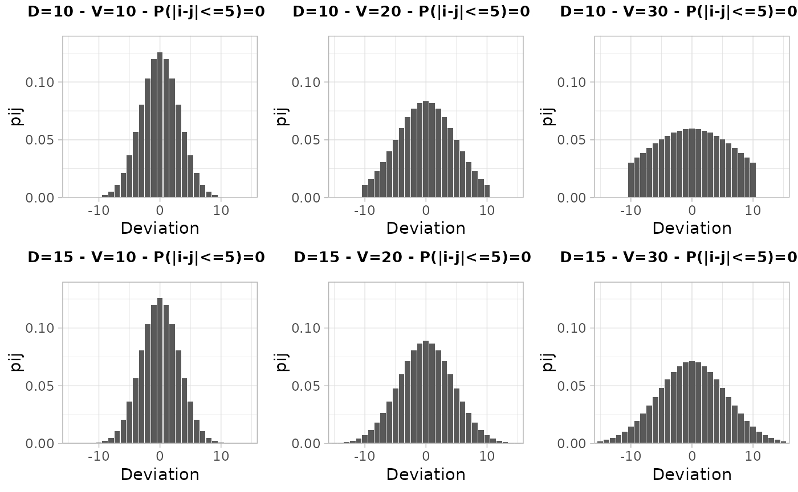

# Applying the Cell Key Method with the \`ckm\` package

## Introduction

This vignette demonstrates how to use the key functions of the package
to apply the Cell Key Method for statistical disclosure control. The
steps include:

1.  Adding keys to microdata using `build_individual_keys`.
2.  Comparing different transition matrices with
    `visualiser_distribution` for various parameter choices.
3.  Simulating risk and utility measures with `simulate_RUs`.
4.  Applying the Cell Key Method with `tabulate_and_apply_ckm` and
    interpreting the results.

## Step 1: Adding Keys to Microdata

First, load the package and example data, then generate individual keys.

``` r
library(dplyr)
```

    ## 
    ## Attaching package: 'dplyr'

    ## The following objects are masked from 'package:stats':
    ## 
    ##     filter, lag

    ## The following objects are masked from 'package:base':
    ## 
    ##     intersect, setdiff, setequal, union

``` r
library(ckm)

# Load example microdata
data("dtest", package = "ckm")

# Set a seed for reproducibility
set.seed(4081789)

# Add individual keys to the microdata
dtest_with_keys <- build_individual_keys(dtest)
head(dtest_with_keys)
```

    ##      SEXE DIPLOME      AGE    DEP    REG   TYPE  TYPE2       VAL    WEIGHT
    ##    <char>  <char>   <char> <char> <char> <char> <char>     <num>     <num>
    ## 1:      G       D  [26,50)     77     11      T     TU  9442.606 1.7778327
    ## 2:      F       N [50,120]     10     44      X    VWX 10297.082 1.3046769
    ## 3:      F       D   [0,26)     44     52      T     TU  9770.001 0.5867569
    ## 4:      F       N  [26,50)     83     93      T     TU 10444.552 1.0662507
    ## 5:      G       D [50,120]     59     32      T     TU 10586.279 1.1571308
    ## 6:      F       N  [26,50)     59     32      T     TU 10330.752 1.4899395
    ##         rkey
    ##        <num>
    ## 1: 0.6934088
    ## 2: 0.9771298
    ## 3: 0.2773011
    ## 4: 0.3990830
    ## 5: 0.4361497
    ## 6: 0.6486956

## Step 2: Comparing Transition Matrices

### Step 2.1: Search Feasible Transition Matrices

``` r
test_matrices(D = 10, js = 4)
```

    ## Tested interval: [ 0 ; 30 ]
    ## Tested interval: [ 0 ; 15 ]
    ## Tested interval: [ 0 ; 7.5 ]
    ## Tested interval: [ 3.75 ; 7.5 ]
    ## Tested interval: [ 5.625 ; 7.5 ]
    ## Tested interval: [ 5.625 ; 6.5625 ]

    ## [1] 6.5625

``` r
test_matrices(D = 15, js = 4)
```

    ## Tested interval: [ 0 ; 30 ]
    ## Tested interval: [ 0 ; 15 ]
    ## Tested interval: [ 0 ; 7.5 ]
    ## Tested interval: [ 3.75 ; 7.5 ]
    ## Tested interval: [ 5.625 ; 7.5 ]
    ## Tested interval: [ 5.625 ; 6.5625 ]

    ## [1] 6.5625

With D equals to 10 or 15 and js equals to 4, the minimal variance that
let us build a transition matrix is`V=6.5625`.

### Step 2.2: Visualize the distributions

We compare the transition matrices for different values of D and V using
`visualiser_distribution`.

``` r
# Visualize transition matrices for different parameter sets
visualize_distribution(D = c(10, 15), V = c(10, 20, 30))
```



With `V<=20`, the distributions ensures that more than `75%` of the
absolute deviations are equal to 5 at most.

## Step 3: Estimating Risk and Simulating Utility Measures

We use `simulate_RUs` to compare the risk and utility for the different
parameter sets. We set `n_sim = 5` for a quick demonstration and use the
categorical variables REG, DIPLOME, AGE, and SEXE.

``` r
# Define the categorical variables
cat_vars <- c("REG", "DIPLOME", "AGE", "SEXE")
# Define the parameters D and V (and js if needed) to test:
parameters <- build_parameters_table(Ds = c(10,15), Vs = c(10, 20), jss = 4)

# Simulate risk and utility for different parameter sets
sim_results <- simulate_RUs(
  df = dtest,
  cat_vars = cat_vars,
  parametres = parameters,
  confident = 5,
  n_sim = 5
)
```

    ##  ■■■■■■■■■                         25% |  ETA:  9s

    ##  ■■■■■■■■■■■■■■■■                  50% |  ETA:  8s

    ##  ■■■■■■■■■■■■■■■■■■■■■■■           75% |  ETA:  4s

``` r
# Display the results
sim_results |> 
  group_by(D, V, js, i, j, risk_inference = qij) |>
  summarise(MAD = mean(MAD), .groups = "drop")
```

    ## # A tibble: 4 × 7
    ##       D     V    js i          j     risk_inference   MAD
    ##   <dbl> <dbl> <dbl> <chr>      <chr>          <dbl> <dbl>
    ## 1    10    10     4 1, 2, 3, 4 5              0.487  2.51
    ## 2    10    20     4 1, 2, 3, 4 5              0.370  3.44
    ## 3    15    10     4 1, 2, 3, 4 5              0.489  2.51
    ## 4    15    20     4 1, 2, 3, 4 5              0.360  3.41

As the risk inference of sensitive values is lower than `50%` for all
sets of parameters, one can choose the one that maximize the utility
(`D=15, V=10`).

## Step 4: Applying the Cell Key Method

Based on the previous results, we select one set of parameters (D = 15,
V = 10) and apply the Cell Key Method using `tabulate_and_apply_ckm`.

``` r
# Apply the Cell Key Method with chosen parameters
res_ckm <- tabulate_and_apply_ckm(
  df = dtest_with_keys,
  cat_vars = cat_vars,
  D = 15,
  V = 10,
  js = 4
)

# Examine the perturbed table
head(res_ckm$tab |> filter(DIPLOME == "D") |> arrange(REG, AGE, SEXE), n = 12)
```

    ## # A tibble: 12 × 6
    ##    REG   DIPLOME AGE      SEXE  nb_obs nb_obs_ckm
    ##    <chr> <chr>   <chr>    <chr>  <int>      <dbl>
    ##  1 1     D       Total    F         11          6
    ##  2 1     D       Total    G         18         19
    ##  3 1     D       Total    Total     29         30
    ##  4 1     D       [0,26)   F          1          0
    ##  5 1     D       [0,26)   G          1          7
    ##  6 1     D       [0,26)   Total      2          9
    ##  7 1     D       [26,50)  F          8         13
    ##  8 1     D       [26,50)  G          8          7
    ##  9 1     D       [26,50)  Total     16         14
    ## 10 1     D       [50,120] F          2          0
    ## 11 1     D       [50,120] G          9          7
    ## 12 1     D       [50,120] Total     11         10
